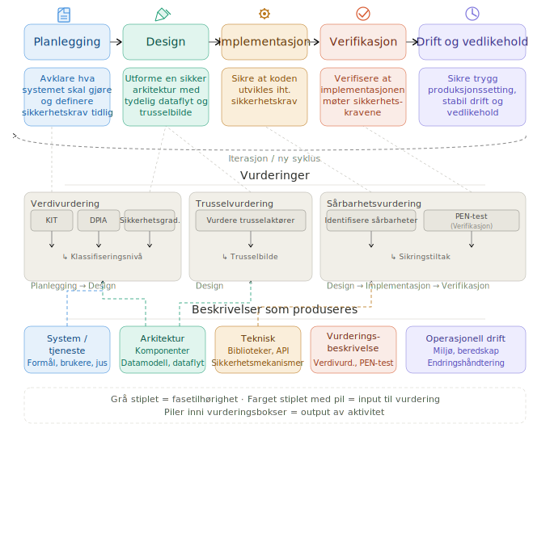

# System beskrivelse – Modulær Systemdokumentasjon

Skillen koordinerer modulære arbeidsrunder som produserer strukturert dokumentasjon av system/tjeneste og vurderinger av systemet/tjenesten.
Filene er organisert i to mapper: **beskrivelse** (hva er systemet) og **vurderinger** (hva er risikoen).

Modul 03 (Funksjoner) er navet — alle vurderingsmoduler refererer tilbake til behandlingsaktivitetene der.
Vurderingsmodulene annoterer også 03-funksjoner.md med klassifiseringer (KIT-nivå, GDPR-grunnlag).

---

## Prosessen



## Mappestruktur

```
{systemnavn}/
├── 01-oversikt.md
├── beskrivelse/
│   ├── 01-funksjonell beskrivelse/
│   │   ├── 1.1a-brukere.md              ← Brukergrupper, roller, tilgangsnivåer.
│   │   ├── 1.1b-roller-og-rettigheter.md ← Detaljert rolletabell og tilgangsnivåer.
│   │   └── 1.2-funksjoner.md            ← KJERNEN. Behandlingsaktiviteter. Oppdateres med KIT og GDPR-grunnlag.
│   └── 02-teknisk beskrivelse/
│       ├── 2.1-komponenter.md        ← Tekniske komponenter, infrastruktur.
│       ├── 2.2-informasjonsmodell.md ← Logisk modell: informasjonsobjekter og attributter.
│       ├── 2.3-datamodell.md         ← Lagringsmodeller og entiteter.
│       ├── 2.4-dataflyt.md           ← Hvordan data flyter mellom komponenter.
│       └── 2.5-drift.md              ← Miljøer, SLA, beredskap, avhengigheter.
└── 03-vurderinger/
    ├── 3.1-verdivurdering-sikkerhetsgradering.md        ← Sikkerhetsloven kap. 5 og 6. Oppdaterer 01-oversikt.
    ├── 3.2-verdivurdering-kit.md                        ← NSM KIT per behandlingsaktivitet.
    ├── 3.3-verdivurdering-personvern.md                 ← GDPR/DPIA per behandlingsaktivitet.
    ├── 3.4-verdivurdering-automatiserte-beslutninger.md ← Art. 22-vurdering.
    ├── 3.5-trusselvurdering.md                          ← Hvem kan angripe verdiene?
    └── 3.6-sårbarhetsvurdering.md                       ← Svakheter, inkl. leverandøravhengigheter.
```

> `README.md` genereres sist i roten av `{systemnavn}/`.

---

## Arbeidsrekkefølge

```
Funksjonell beskrivelse:    01-oversikt → 1.1a-brukere + 1.1b-roller → 1.2-funksjoner
Teknisk beskrivelse:        2.1-komponenter → 2.2-informasjonsmodell → 2.3-datamodell → 2.4-dataflyt → 2.5-drift

Vurderinger (etter at beskrivelsen er på plass):
  3.1-verdivurdering-sikkerhetsgradering → 3.2-verdivurdering-kit → 3.3-verdivurdering-personvern
  → 3.4-verdivurdering-automatiserte-beslutninger → 3.5-trusselvurdering → 3.6-sårbarhetsvurdering

Vurderingsmodulene oppdaterer:
  - 3.1-verdivurdering-sikkerhetsgradering → 01-oversikt.md (Sikkerhetsgradering)
  - 3.2-verdivurdering-kit og 3.3-verdivurdering-personvern → 1.2-funksjoner.md (KIT-nivå, GDPR-grunnlag)
```

---

## Hvem gjør hva — og når

| Fase | Rolle | Moduler |
|------|-------|---------|
| Plan og design | Produkteier | 01-oversikt, 1.1a-brukere + 1.1b-roller, 1.2-funksjoner |
| Plan og design | Techlead + produkteier | 2.2-informasjonsmodell |
| Implementasjon | Techlead / utvikler | 2.1-komponenter, 2.3-datamodell, 2.4-dataflyt |
| Drift | Techlead / utvikler | 2.5-drift |
| Vurdering | Sikkerhetsansvarlig | 3.1-verdivurdering-sikkerhetsgradering |
| Vurdering | Techlead + sikkerhetsansvarlig | 3.2-verdivurdering-kit, 3.5-trusselvurdering, 3.6-sårbarhetsvurdering |
| Vurdering | Techlead + personvernombud | 3.3-verdivurdering-personvern, 3.4-verdivurdering-automatiserte-beslutninger |

---

## Modulinstruksjoner

| Modul | Instruksjonsfil | Outputsti |
|-------|----------------|-----------|
| 01 Oversikt | `modules/01-oversikt.md` | `01-oversikt.md` |
| 02 Brukere | `modules/02-brukere.md` | `beskrivelse/01-funksjonell beskrivelse/1.1a-brukere.md` + `1.1b-roller-og-rettigheter.md` |
| 03 Funksjoner | `modules/04-funksjoner.md` | `beskrivelse/01-funksjonell beskrivelse/1.2-funksjoner.md` |
| 04 Komponenter | `modules/05-komponenter.md` | `beskrivelse/02-teknisk beskrivelse/2.1-komponenter.md` |
| 05 Informasjonsmodell | `modules/03-informasjonsmodell.md` | `beskrivelse/02-teknisk beskrivelse/2.2-informasjonsmodell.md` |
| 06 Datamodell | `modules/06-datamodell.md` | `beskrivelse/02-teknisk beskrivelse/2.3-datamodell.md` |
| 07 Dataflyt | `modules/07-dataflyt.md` | `beskrivelse/02-teknisk beskrivelse/2.4-dataflyt.md` |
| 08 Drift | `modules/08-drift.md` | `beskrivelse/02-teknisk beskrivelse/2.5-drift.md` |
| Verdivurdering Sikkerhetsgradering | `modules/12-verdivurdering-sikkerhetsgradering.md` | `03-vurderinger/3.1-verdivurdering-sikkerhetsgradering.md` |
| Verdivurdering KIT | `modules/09-verdivurdering-kit.md` | `03-vurderinger/3.2-verdivurdering-kit.md` |
| Verdivurdering Personvern | `modules/10-verdivurdering-personvern.md` | `03-vurderinger/3.3-verdivurdering-personvern.md` |
| Verdivurdering Automatiserte beslutninger | `modules/11-verdivurdering-automatisertebeslutninger.md` | `03-vurderinger/3.4-verdivurdering-automatiserte-beslutninger.md` |
| Trusselvurdering | `modules/13-trusselvurdering.md` | `03-vurderinger/3.5-trusselvurdering.md` |
| Sårbarhetsvurdering | 🔲 Ikke laget ennå | `03-vurderinger/3.6-sårbarhetsvurdering.md` |
| README (avslutning) | `modules/00-readme-generator.md` | `README.md` |
| Konsistensgjennomgang | `modules/00-review.md` | — |

---

## Generelle prinsipper

- **Vær konkret** — bruk systemets faktiske navn, ikke generiske plassholdere
- **Vær konsistent** — referer til samme komponent, rolle eller aktivitet med samme navn gjennom alle moduler
- **Vær eksplisitt** — ikke anta at leseren vet hva en "komponent" eller "behandlingsaktivitet" er — beskriv det i klartekst
- **Still spørsmål til brukeren om det som er uklart** — det er bedre å ha en ufullstendig beskrivelse enn en feilaktig en
- **Ufullstendig er OK** — marker ukjent informasjon med `🔲 Ikke kartlagt`
- **Modul 03 er nøkkelen** — behandlingsaktivitetene i `1.2-funksjoner.md` brukes i alle vurderingsmoduler
- **Vurderinger annoterer 1.2-funksjoner** — KIT-nivå og GDPR-grunnlag føres tilbake til oversiktstabellen
- **README genereres sist** — når alle ønskede moduler er ferdig
- Spør alltid: *"Vil du fortsette med neste modul, eller er det noe her som skal justeres først?"*

@~/.claude/skills/system-beskrivelse/shared/diagram-c4.md
